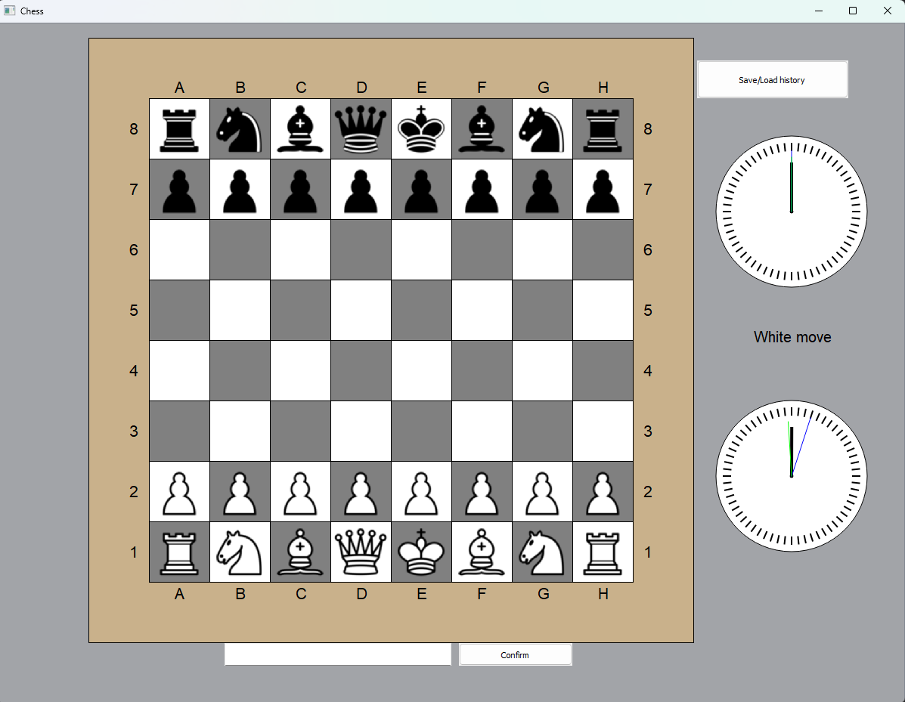
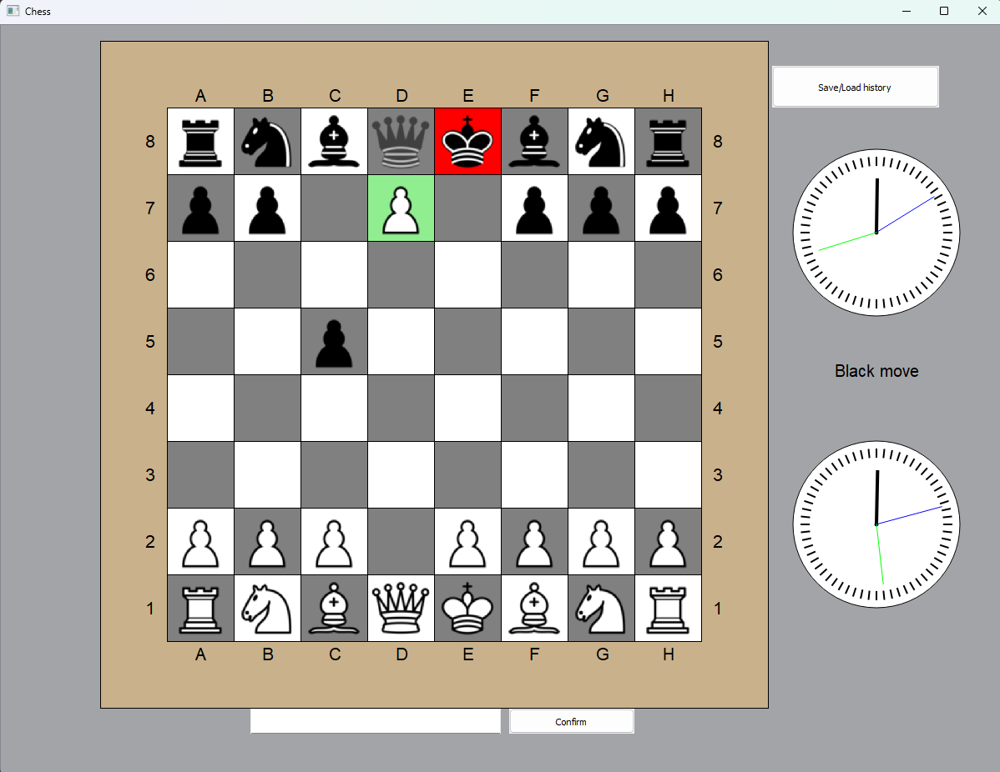
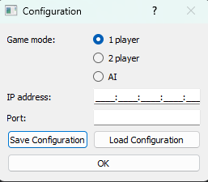
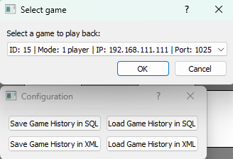

<h1> Chess Game</h1>

Chess app with all the rules (including castling, en passant, pawn promotion) and animated clocks. There are options to save history to database or xml file. First option dialog allow player to choose between playing alone, with another player or with AI.

<h2> Board </h2>
There is the board with all pieces and clock for each player.

<h2> Rules</h2>
When user press the piece, all legal moves are highlighted in green. Checked king is highlighted in red.

<h2>Config</h2>
In the configuration window, the user can select the type of game, enter the IPv6 address and port. All options can be saved to a json file.

<h2>History</h2>
User can also save game history to SQLite3 database or XML file. There is an option to playback all saved games.

<h2>AI</h2>
User in option can choose playing with AI. If so, next move for black will be generated by minimax algorithm.

<h2>2 player</h2>
User can also play with another player. First, he need to run server on IPv6 and then choose appropriate option, type in address and port. 